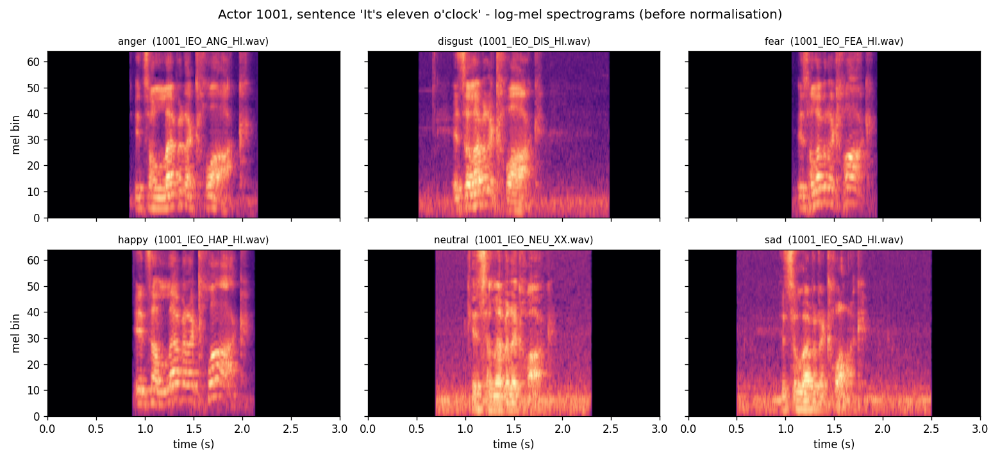
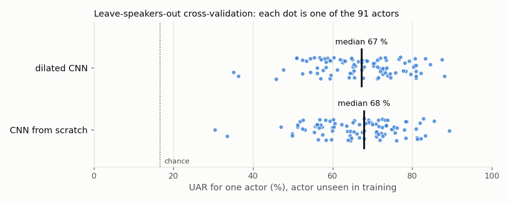
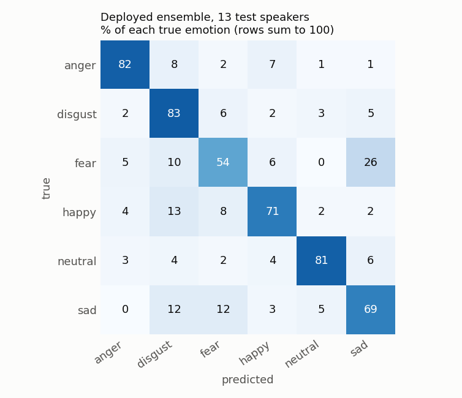
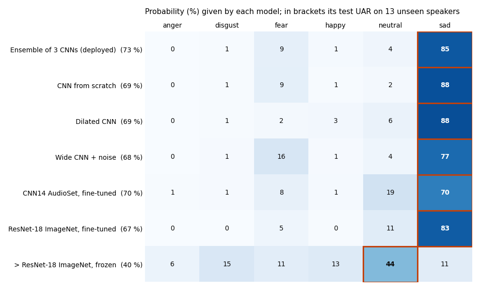

# Voice Emotion CNN

Speech emotion recognition with convolutional networks on log-mel spectrograms,
evaluated on **speakers the models never heard**, with a web page where anyone can
record their voice, see its spectrogram and get a prediction.
Course project by **Hugo Lequy** (ENSTA, apprentissage pour la robotique).

- **Live demo:** https://huggingface.co/spaces/hugodush/voice-emotion-cnn
- **Code:** https://github.com/hugodush55/voice-emotion-cnn

| | test UAR, 13 unseen speakers | 5-fold CV, all 91 actors unseen |
|---|---|---|
| **Deployed: ensemble of 3 CNNs trained from scratch** | **73.2 %** | |
| CNN from scratch (course design, 1.2 M parameters) | 68.8 ± 0.2 % | 66.3 % |
| Dilated CNN (course design, 1.3 M parameters) | 68.8 ± 0.5 % | 67.0 % |
| Transfer: ResNet-18 ImageNet, fine-tuned | 66.7 ± 1.4 % | |
| Transfer: ResNet-18 ImageNet, frozen backbone | 39.7 % | |
| Transfer: CNN14 AudioSet, fine-tuned | 69.1 ± 0.8 % | |
| Human listeners, majority vote, audio only | 40.5 % | 42.9 % |
| Chance (6 classes) | 16.7 % | 16.7 % |

UAR = unweighted average recall (mean of the six per-class recalls). Test column: mean ± std over
3 seeds. CV column: pooled over the 7,442 clips of the 5 folds.

---

## 1. Data

**CREMA-D** ([github.com/CheyneyComputerScience/CREMA-D](https://github.com/CheyneyComputerScience/CREMA-D)):
7,442 English clips from **91 actors** (48 male, 43 female, aged 20-74) reading 12 sentences with
6 emotions: anger, disgust, fear, happy, neutral, sad (1,271 clips each, 1,087 neutral).
It is the largest and most speaker-diverse of the corpora proposed in the course, which matters
for an app that strangers will use.

**Speaker-independent split** (`src/dataset.py`, saved in `data/splits.csv`): actors, not clips,
are assigned to splits, balanced by sex: **65 train / 13 validation / 13 test actors**
(5,316 / 1,066 / 1,060 clips). `check_speaker_disjoint` asserts that no actor appears in two
splits, and the test suite checks it. The validation speakers are used for every choice
(best epoch, hyper-parameters, ensembles); the test speakers only for the final numbers.

**Leave-speakers-out cross-validation** (`cv_speaker_split`): the 91 actors are also dealt into
5 sex-balanced folds, so that every actor is a test speaker exactly once (section 4.2).

## 2. Pre-processing

Shared by training and the app (`src/audio.py`), so the deployed model sees exactly what it was
trained on:

1. mono, **16 kHz**; leading/trailing silence trimmed (30 dB); peak-normalised (the recording gain
   of a laptop microphone has nothing to do with the corpus);
2. a **3 s window**: centred at test time, random position at training time (random time shift);
   longer recordings in the app are scored with 3 s windows every 1 s and the probabilities averaged;
3. short-time spectrum with **25 ms frames every 10 ms** (301 frames), **64 mel bands**, log
   magnitude, **standardised per mel band with statistics of the training speakers only**. The
   statistics are stored in the model checkpoint.

The log is the natural log rather than dB: the two differ by a constant factor (10 / ln 10) that
the standardisation removes, so the network input is identical.



## 3. Models

All models take the waveform, compute the log-mel inside the network (on the GPU) and apply
**SpecAugment** (2 frequency masks of up to 10 bands, 2 time masks of up to 40 frames) during
training only (`src/models.py`).

| model | idea | trainable parameters |
|---|---|---|
| **ScratchCNN** | the course design: 4 blocks of [two 3x3 conv + batch-norm + ReLU] then 2x2 max-pooling, 32-64-128-256 channels, dropout, one linear layer. Pooling: mean over frequency, then mean **and** max over time (concatenated) instead of plain global average pooling. | 1,175,718 |
| **DilatedCNN** | the course's own design: 3x3 kernels dilated along time only (rates 1-2-4-8-16-32), frequency halved after each layer, **no temporal pooling**. Receptive field measured at 129 frames = **1.29 s** (a whole phrase) at 10 ms resolution. | 1,313,526 (width 48) |
| **ResNet-18 (ImageNet)** | transfer learning from images: the spectrogram is copied to 3 channels, the 1000-class layer replaced by a 6-class head. Two variants: **frozen backbone** (only the head is trained) and **fine-tuned** (backbone learning rate 10x smaller than the head). | 3,078 frozen / 11.2 M |
| **CNN14 (AudioSet)** | extra transfer experiment: the PANNs CNN14 (Kong et al. 2020) pretrained on 2 M AudioSet clips at 16 kHz. Its original front end is reproduced exactly (the mel filterbank matches the one stored in the checkpoint to 5e-8). | 12 k frozen / 80 M |

**Training** (`src/train.py`): AdamW (weight decay 0.01), one-cycle learning-rate schedule
(max 1e-3, 3e-4 for fine-tuned ResNet), cross-entropy with label smoothing 0.1, batch 64,
60 epochs, bf16 mixed precision on an RTX 4060 laptop GPU (about 10 s per epoch for the
scratch CNN). The checkpoint kept is the epoch with the best **validation UAR**.

Lesson learned: early stopping with patience 12 first cut three of four runs *before* the
one-cycle schedule had lowered the learning rate (validation UAR oscillates between 41 % and 62 %
while it is high). The published runs train for the full schedule and keep the best validation epoch.

## 4. Results

All numbers are on speakers never seen in training. Test = the 13 held-out actors (1,060 clips),
mean ± std over 3 seeds unless stated otherwise. Full table: `reports/results/summary.md`;
per-run JSON, learning curves and confusion matrices in `reports/`.

### 4.1 Main comparison

| model | seeds | trainable params | val UAR % | test UAR % | test macro-F1 % |
|---|---|---|---|---|---|
| CNN from scratch | 3 | 1,175,718 | 70.0 ± 0.8 | **68.8 ± 0.2** | 68.6 ± 0.1 |
| Dilated CNN (width 48) | 3 | 1,313,526 | 71.6 ± 0.1 | **68.8 ± 0.5** | 68.8 ± 0.5 |
| ResNet-18 ImageNet, frozen backbone | 1 | 3,078 | 41.1 | 39.7 | 37.5 |
| ResNet-18 ImageNet, fine-tuned | 3 | 11,179,590 | 68.0 ± 0.1 | 66.7 ± 1.4 | 66.3 ± 1.5 |
| CNN14 AudioSet, frozen backbone | 1 | 12,294 | 43.3 | 45.2 | 44.5 |
| CNN14 AudioSet, fine-tuned (40 epochs) | 3 | 79,686,086 | 69.0 ± 0.2 | 69.1 ± 0.8 | 68.4 ± 1.0 |
| **Ensemble** (scratch + dilated + wide scratch) | - | 7.2 M in total | 74.8 | **72.9 / 73.2** | 73.2 |

- **From scratch vs transfer.** A 1.2 M-parameter CNN trained from scratch matches or beats
  11 M- and 80 M-parameter pretrained networks. With 5,300 training clips, the domain matters more
  than the size.
- **Frozen backbones fail, in line with the course slide** ("struggles when the domain gap is
  large"): ImageNet features + a linear head reach 39.7 %. Features learnt on audio (AudioSet) are
  better frozen (45.2 %) but still far behind fine-tuning, because emotion lives in pitch and
  voice-quality details that sound-event features were not trained to separate.
- **Dilation** (course question "we test whether it helps"): same test UAR as the scratch CNN on the
  fixed split, better validation UAR, and +0.7 points on average over the 5 CV folds (it wins 4 folds
  of 5: +1.0, +2.0, +0.9, +0.7, -1.3). A small gain, not conclusive with 5 folds, for a similar
  parameter count (1.31 M vs 1.18 M).
- **Ensemble** (deployed): averaging the probabilities of three from-scratch CNNs adds about 4 points.
  The members were chosen on **validation** UAR among the 92 combinations of up to three of eight
  candidate checkpoints (`python -m src.evaluate ...`, `reports/results/ensembles.json`); the test
  speakers were not used. 72.9 % with the centred 3 s window, 73.2 % with the app's sliding windows.
  The 74.8 % validation score is slightly optimistic because it was the selection criterion.

### 4.2 Leave-speakers-out cross-validation

The fixed split rests on 13 test actors, and the course asks that "every number is on unseen
voices". Each architecture was therefore also trained 5 times, each time holding out a different
fifth of the actors (about 18) for testing and 11 more for validation; together the folds score all
91 actors as unseen speakers (`--split cv --fold k`).

| model | UAR per fold % | mean ± std | pooled over 7,442 clips | per-actor UAR, median [min-max] |
|---|---|---|---|---|
| CNN from scratch | 65.3 / 65.3 / 69.5 / 65.6 / 65.6 | 66.2 ± 1.6 | **66.3 %** | 68 % [30-89] |
| Dilated CNN | 66.3 / 67.3 / 70.4 / 66.3 / 64.3 | 66.9 ± 2.0 | **67.0 %** | 67 % [35-88] |



- The CV estimate (66-67 %) is about 2 points below the fixed split (68.8 %): our 13 test actors
  happen to be slightly easier than average, and each CV model is trained on 61-63 actors instead
  of 65. **66-67 % is the more trustworthy figure** for a new voice.
- **Who is speaking matters more than the architecture.** The same model scores from 30 % to 89 %
  depending on the actor: the gap between two actors is ten times the gap between two models.

### 4.3 What the speaker split changes

The course warns that splitting clips at random lets the network recognise the *person*
(a published CNN reaches 99.89 % on a corpus with two speakers). The same scratch CNN trained on a
**random clip split** reaches 69.9 ± 0.3 % test UAR, against 68.8 ± 0.2 % with the speaker split.

On CREMA-D the inflation is small (about 1 point) because each of the 91 actors is only about 1 %
of the data: a network gains little by memorising voices. With 2 or 10 speakers the same mistake is
far more rewarding, which is why it produces spectacular and meaningless scores on small corpora.
The two test sets contain different clips, so this gap is indicative only.

### 4.4 Things that did not help (validation first, single seed then 3 seeds)

| idea | val UAR | test UAR | verdict |
|---|---|---|---|
| scratch CNN, reference | 70.0 ± 0.8 | 68.8 ± 0.2 | |
| train 100 epochs instead of 60 | 69.8 | 67.7 | no gain |
| mixup (alpha 0.4) | 69.7 | 69.0 | no gain |
| white noise at 10-40 dB SNR | 70.3 | 69.9 | within seed noise |
| 2x wider (4.7 M parameters) + noise, 3 seeds | 71.1 ± 0.4 | 68.5 ± 0.8 | better val, not test |
| ResNet-18 with a 2x upsampled input | 69.2 | 67.7 | +1 point over plain fine-tuning |
| CNN14 AudioSet + mixup + noise | 67.4 | 68.4 | worse than plain CNN14 |

### 4.5 Per-class behaviour



Deployed ensemble on the 13 test speakers (`python -m src.final_report`):

| | anger | disgust | fear | happy | neutral | sad |
|---|---|---|---|---|---|---|
| recall % | 81.8 | 82.9 | 53.6 | 70.7 | 81.3 | 69.1 |
| F1 % | 83.9 | 72.6 | 58.8 | 74.2 | 83.4 | 66.3 |

Anger, disgust and neutral are recognised best. **Fear is the hardest class, and a quarter of the
fear clips are taken for sadness**; sadness in turn leaks into disgust and fear, and happiness into
disgust. A plausible reading is that many actors play fear and sadness with a similarly quiet,
tense voice. The listeners (section 4.6) also struggle most with sadness, happiness, disgust and fear.

### 4.6 Human reference

CREMA-D also publishes what its crowd-sourced raters answered. From the voice alone, the
**majority vote of the listeners matches the emotion the actor intended with a UAR of 42.9 %**
(49.1 % if ties that include the right answer count; 40.5 % on our 13 test actors),
`python -m src.human_baseline`:

| | anger | disgust | fear | happy | neutral | sad |
|---|---|---|---|---|---|---|
| listeners' majority vote, recall % | 60.6 | 27.0 | 32.0 | 26.0 | 95.7 | 16.4 |

Listeners fall back on "neutral" whenever an emotion is subtle. The CNN, trained on the intended
labels, is well above this (68.8 %), but the comparison says as much about the corpus as about the
model: it has learnt the acting conventions of these 91 actors, which listeners do not share.

## 5. The app

**Gradio** page on a free Hugging Face Space (`gradio_app.py`). Record with the microphone (or upload
a file), **choose a model** (default: the deployed ensemble) and get:

- the probabilities of the six emotions according to the chosen model;
- **Spectrogram tab**: the log-mel of the 3 s window the CNN classified, and a **Grad-CAM** map
  (`src/gradcam.py`) showing which time-frequency regions pushed the network towards its answer;
- **Waveform, pitch and vocal-fold pulses tab**: the waveform with the **F0 contour** (pYIN), and an
  **estimated laryngogram**: the glottal airflow obtained by **inverse filtering** (IAIF, Alku 1992,
  `src/voice_analysis.py`). Linear prediction models the vocal tract and removes it from the speech,
  leaving the vocal-fold pulses; dotted lines mark the estimated glottal closures. A real
  laryngograph needs neck electrodes; this estimate uses the audio only. On a synthetic vowel with a
  known glottal pulse the estimate correlates at **0.98** with the truth (a sine at the same pitch
  scores 0.75), and its periodicity is exactly the synthesised 120 Hz (`tests/test_voice_analysis.py`);
- **Compare models tab**: the answer of all seven models on the same recording, next to their test
  UAR: the ensemble, its three from-scratch members, CNN14 AudioSet, and ResNet-18 ImageNet
  fine-tuned and frozen. It makes the results of section 4 visible on your own voice: the frozen
  ImageNet network is usually the odd one out.



*A sad test clip (actor 1047): six models answer "sad", the frozen ResNet-18 hesitates towards "neutral".*

The models offered are listed in `app/models/registry.json`. Every checkpoint runs once per
recording (an ensemble reuses its members' outputs); an analysis with all figures takes about
10 s on the free Space. CNN14 (319 MB) exceeds GitHub's file limit, so it is only on the Space;
without it the app simply offers the other six models.

A plain **FastAPI** version with its own HTML recording page also exists (`app/main.py`,
`app/static/index.html`): `POST /predict` returns the probabilities and the spectrogram.

The free Space sleeps after 48 h without visitors; the first visit then shows "Starting" for about a
minute.

## 6. Reproduce

```bash
python3 -m venv .venv && source .venv/bin/activate
pip install -r requirements.txt
# CREMA-D audio (about 600 MB) into data/CREMA-D/AudioWAV, and VideoDemographics.csv into data/CREMA-D/
python -m src.dataset                     # waveform cache, speaker split, example figure
python -m src.train --arch scratch        # --arch dilated|resnet18|cnn14, --split random|cv --fold k, --seed s
python -m src.summarize                   # reports/results/summary.md
python -m src.evaluate <checkpoint names> # single models and ensembles, val and test UAR
python -m pytest                          # 21 tests, about 10 s (one needs CREMA-D and is skipped without it)
python gradio_app.py                      # the app on http://localhost:7860
scripts/deploy_space.sh                   # push the app to the Hugging Face Space
```

The experiment series are scripted in `scripts/explore.sh`, `scripts/confirm.sh`, `scripts/confirm_rest.sh` and `scripts/round4.sh`.
CNN14 needs `checkpoints/pretrained/Cnn14_16k.pth` from
[zenodo.org/records/3987831](https://zenodo.org/records/3987831).

## 7. Repository layout

```
src/audio.py            pre-processing and log-mel front end (training and app)
src/dataset.py          CREMA-D index, speaker split, CV folds, waveform cache, Dataset
src/models.py           ScratchCNN, DilatedCNN, ResNet-18 and CNN14 transfer, SpecAugment
src/train.py            training, model selection on validation speakers, test evaluation, figures
src/evaluate.py         ensembles and sliding-window evaluation of saved checkpoints
src/summarize.py        results table
src/final_report.py     final numbers and figures (deployed ensemble, CV per actor)
src/human_baseline.py   how often CREMA-D's listeners recognise the intended emotion
src/gradcam.py          Grad-CAM on the spectrogram
src/voice_analysis.py   pitch and IAIF glottal-flow estimate
gradio_app.py           the deployed app
app/                    FastAPI app, figures for the app, models offered (app/models/registry.json)
deploy/                 Hugging Face Space configuration
scripts/                experiment series and deployment
tests/                  pytest suite
reports/                results (JSON, summary) and figures
data/splits.csv         which actor is in which split
```

## 8. Limitations

- **Acted emotions.** CREMA-D actors perform six emotions on 12 fixed sentences. Spontaneous speech
  is subtler and more mixed, and predictions on it are much less reliable.
- **Same sentences in train and test.** Test *speakers* are unseen, test *sentences* are not.
- **English only.** Prosody carries across languages to some extent, but a French or German speaker
  is further from the training data.
- **Microphone mismatch.** Studio recordings versus laptop and phone microphones, rooms and noise.
  Peak normalisation and silence trimming reduce but do not remove the gap.
- **The labels are the intended emotions, not what listeners hear** (section 4.6): the models learn
  the actors' conventions for each emotion, which may not transfer to how people really sound.

## 9. Who did what

**Hugo Lequy**, alone: the course expects teams of 3, and I did the whole project by myself
(data pipeline, models and experiments, evaluation, app, deployment, report).

**AI assistance.** The code was written with the help of an AI coding assistant (Claude Code,
Anthropic). I set the objectives and constraints from the course brief and slides, chose the corpus,
reviewed the design choices and the results, created and configured the GitHub and Hugging Face
accounts, and tested the deployed app.
